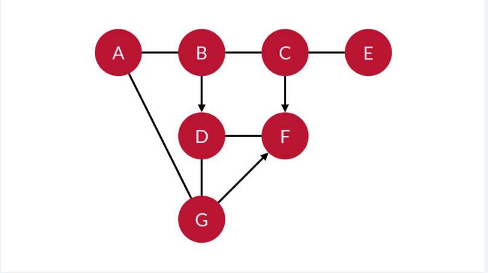
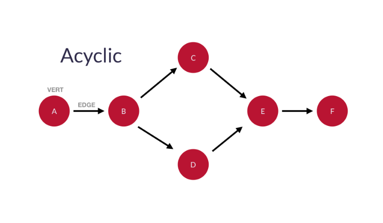
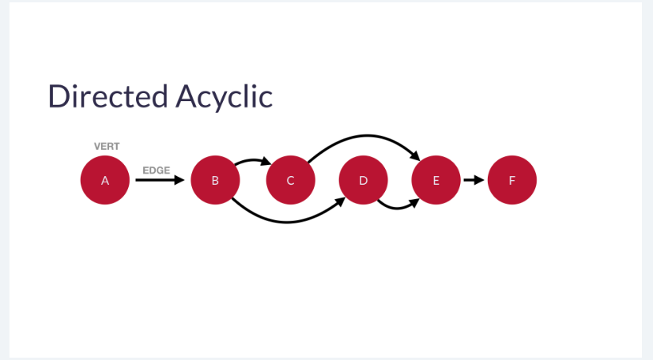
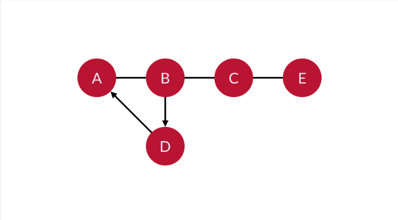

# GRAPHS

Graphs are collections of related data. They’re like trees, except connections can be made from any node to any other node, even forming loops. By this definition, all trees are graphs, but not all graphs are trees.

We call the nodes in a graph vertexes (or vertices or verts), and we call the connections between the verts edges.

An edge denotes a relationship or linkage between the two verts.

- nodes in a graph vertexes (or vertices or verts)
- connections between the verts edges.
    - An edge denotes a relationship or linkage between the two verts.

# what Graphs Represent 
# Graphs can represent any kind of multi-way relational data.

-A graph could show a collection of cities and their linking roads.

-It could show a collection of computers on a network.

-It could show a population of people who know each other and Kevin Bacon.

-It could represent trade relationships between nations.

-It could represent the money owed in an ongoing poker night amongst friends.

# Types of Graphs
# Directed and Undirected Graphs
# The nature of the relationship that is being represented is what determines if a directed or undirected graph should be used.  

# Directed
If the relationship could be described as “one way”, then a directed graph makes the most sense. For example, representing the owing of money to others (debt) with a directed graph would make sense.
-A directed graph has at `least one edge` that is not `bidirectional`. 
-So, again, we can draw our 7 verts and then connect them with edges. This time, we just need to make sure that one of the edges is an arrow pointing in only one direction.

# Undirected
-If the nature of the relationship is a _mutual exchange_, then an undirected graph makes the most sense. 
-For example, we could use an undirected graph to represent users who have exchanged money at some point in the past. 
-Since an “exchange” relationship is always mutual, an undirected graph makes the most sense here.

# Cyclic Graphs
- If you can form a cycle (for example, follow the edges and arrive again at an already-visited vert), the graph is cyclic. 
-For example, in the image below, you can start at B and then follow the edges to C, E, D, and then back to B (which you’ve already visited).

#  Acyclic 
- cannot form a cycle (for example, you cannot arrive at an already-visited vert by following the edges), we call the graph acyclic. 
-In the example below, no matter which vert you start at, you cannot follow edges in such a way that you can arrive at an already-visited vert.

 

# Weighted 
- Weighted graphs have VALUES associated with the edges. 
-We call the specific values assigned to each edge WEIGHTS.
-For example, if you were building a graph to represent a map for bicycle routes
    -give roads with bad car traffic or very steep inclines unnaturally large weights. 
    -That way a routing algorithm would be unlikely to take them. 

-We can further modify weights. For example, if you were building a graph to represent a map for bicycle routes, we could` give roads with bad car traffic or very steep incline`s unnaturally `large weights`. That way a routing `algorithm would be unlikely to take them`. (This is how Google Maps avoids freeways when you ask it for walking directions.)

# Directed Acyclic Graphs (DAGs)
A directed acyclic graph (DAG) is a directed graph with no cycles. In other words, we can `order a DAG’s vertices linearly` in such a way that every `edge` is `directed from earlier to later in the sequence`.

A DAG has several applications.` DAGs can modely many different kinds of information`. Below is a short list of possible applications:

-A spreadsheet where a `vertex represents each cell` and an `edge for where one cell’s _formula_ uses another cell’s _value_`.
-The milestones and activities of largescale projects where a `topological ordering can help optimize the schedule of the projects` to `use as little time as possible`.
-`Collections of events and their influence on each other like `family trees or version histories.

-It is also notable that git uses a DAG to represent commits. 
-A commit can have a child commit, or more than one child commit (in the case of a branch). 
-A child could come from one parent commit, or from two (in the case of a merge). 
-But there’s no way to go back and form a repeating loop in the git commit hierarchy.

# ex 3
# cyclic directed graph (5 verts)
