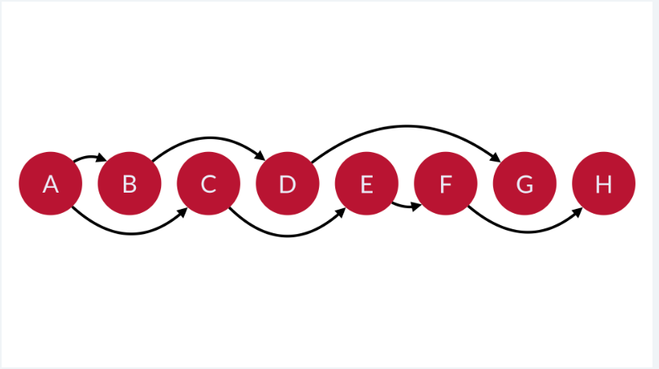

# GRAPHS

Graphs are collections of related data. They’re like `trees`, except connections can be made from any node to any other node, even forming loops (not just L & R nodes)

Components:
`nodes / vertices` - repr objects in data set (cities, animals, web pages)
`edges` - connections between vertices; can be bidrectional (subclasses of animals, from page a what can be accessed)
`weight` - cost to travel across an edge  (resources may be diff to get from one node to another)

# ways to implement graph
# Diff sets
# V ={vo, v1, v2, v3, v4, v5} verticies sets
# E = {(vo,v1, 5), (v1, v2, 4) etc} edges sets (2 nodes connected, optional weight attribute)

# application:
- Location map: stops w/ diff nodes, diff trains (edges)
- Network of activity, on GH- uses graph 

# COLLECTIONs of relational data representd by nodes & _connections_ between nodes 
-diff physical & conceptual networks

 By this definition, all trees are graphs, but not all graphs are trees.

We call the nodes in a graph vertexes (or vertices or verts), and we call the connections between the verts edges.

An edge denotes a relationship or linkage between the two verts.

- nodes in a graph vertexes (or vertices or verts)
- connections between the verts edges.
    - An edge denotes a relationship or linkage between the two verts.

# what Graphs Represent 
# Graphs can represent any kind of multi-way relational data.

-A graph could show a collection of cities and their linking roads.

-It could show a collection of computers on a network.

-It could show a population of people who know each other and Kevin Bacon.

-It could represent trade relationships between nations.

-It could represent the money owed in an ongoing poker night amongst friends.

# Types of Graphs

# Directed and Undirected Graphs
(The nature of the relationship that is being represented is what determines if a directed or undirected graph should be used) 

# Directed (is a weighted graph)
If the relationship could be described as “one way”, then a directed graph makes the most sense. For example, representing the owing of money to others (debt) with a directed graph would make sense.
-A directed graph has at `least one edge` that is not `bidirectional`. 
-So, again, we can draw our 7 verts and then connect them with edges. This time, we just need to make sure that one of the edges is an arrow pointing in only one direction.

# Undirected(is a weighted graph)
-If the nature of the relationship is a _mutual exchange_, then an undirected graph makes the most sense. 
-For example, we could use an undirected graph to represent users who have exchanged money at some point in the past. 
-Since an “exchange” relationship is always mutual, an undirected graph makes the most sense here.

# Cyclic Graphs (edges allow you to visit at least one vert/node) Some can have `unweighted` edges
- If you can form a cycle (for example, follow the edges and arrive again at an already-visited vert), the graph is cyclic. 
-For example, in the image below, you can start at B and then follow the edges to C, E, D, and then back to B (which you’ve already visited).

#  Acyclic(vertices can only be visited once) 
- cannot form a cycle (for example, you cannot arrive at an already-visited vert by following the edges), we call the graph acyclic. 
-In the example below, no matter which vert you start at, you cannot follow edges in such a way that you can arrive at an already-visited vert.

 

# Weighted 
- Weighted graphs have VALUES associated with the edges. 
-We call the specific values assigned to each edge WEIGHTS.
-For example, if you were building a graph to represent a map for bicycle routes
    -give roads with bad car traffic or very steep inclines unnaturally large weights. 
    -That way a routing algorithm would be unlikely to take them. 

-We can further modify weights. For example, if you were building a graph to represent a map for bicycle routes, we could` give roads with bad car traffic or very steep incline`s unnaturally `large weights`. That way a routing `algorithm would be unlikely to take them`. (This is how Google Maps avoids freeways when you ask it for walking directions.)

# Directed Acyclic Graphs (DAGs)
A directed acyclic graph (DAG) is a directed graph with no cycles. In other words, we can `order a DAG’s vertices linearly` in such a way that every `edge` is `directed from earlier to later in the sequence`.

A DAG has several applications.` DAGs can modely many different kinds of information`. Below is a short list of possible applications:

-A spreadsheet where a `vertex represents each cell` and an `edge for where one cell’s _formula_ uses another cell’s _value_`.
-The milestones and activities of largescale projects where a `topological ordering can help optimize the schedule of the projects` to `use as little time as possible`.
-`Collections of events and their influence on each other like `family trees or version histories.

-It is also notable that git uses a DAG to represent commits. 
-A commit can have a child commit, or more than one child commit (in the case of a branch). 
-A child could come from one parent commit, or from two (in the case of a merge). 
-But there’s no way to go back and form a repeating loop in the git commit hierarchy.

# ex 3
# cyclic directed graph (5 verts)

# 4 
# acyclic graph (Directed Acyclic Graph DAG) 9 verts

-acyclic—we can order a DAG’s vertices linearly in such a way that every edge is directed from earlier to later in the sequence.
-For this graph, we will draw our 9 verts in a line from left to right. Then, we will draw our edges making sure that the edges always point from left to right (earlier to later in the sequence).

# Adjancy List
`Notice that this adjacency list doesn’t use any lists. The vertices collection is a dictionary which lets us access each collection of edges in O(1) constant time. Because the edges are contained in a set we can check for the existence of edges in O(1) constant time`

class Graph:
    def __init__(self):
        self.vertices = {
                            "A": {"B"},
                            "B": {"C", "D"},
                            "C": {"E"},
                            "D": {"F", "G"},
                            "E": {"C"},
                            "F": {"C"},
                            "G": {"A", "F"}
                        }

# Adjency Matrix
class Graph:
    def __init__(self):
        self.edges = [[0,1,0,0,0,0,0],
                      [0,0,1,1,0,0,0],
                      [0,0,0,0,1,0,0],
                      [0,0,0,0,0,1,1],
                      [0,0,1,0,0,0,0],
                      [0,0,1,0,0,0,0],
                      [1,0,0,0,0,1,0]]

We represent this matrix as a two-dimensional array–a list of lists. With this implementation, we get the benefit of `built-in edge weights`. `0 denotes no relationship`, but `any other value that is present represents an edge label or edge weight`. The drawback is that we do not have a built-in association between the vertex values and their index.

`In practice, implementing both the adjacency list and adjacency matrix would contain more information by including Vertex and Edge classes.`

Shorthand	Property
V	Total number of vertices in the graph
E	Total number of edges in the graph
e	Average number of edges per vertex
Space Complexity
Adjacency Matrix
Complexity: O(V^2) space
---------------------------------------------------------------

Consider a dense graph where each vertex points to each other vertex. Here, the total number of edges will approach V^2. This means that regardless of whether you choose an adjacency list or an adjacency matrix, both will have a comparable space complexity. However, dictionaries and sets are less space efficient than lists. So, for dense graphs (graphs with a high average number of edges per vertex), the adjacency matrix is more efficient because it uses lists instead of dictionaries and sets.
---------------------------------------------------------------------------

Add Vertex
Adjacency Matrix
Complexity: O(V) time

For an adjacency matrix, we would need to add a new value to the end of each existing row, then add a new row at the end.

for v in self.edges:
  self.edges[v].append(0)
v.append([0] * len(self.edges + 1))
Remember that with Python lists, appending to the end of a list is O(1) because of over-allocation of memory but can be O(n) when the over-allocated memory fills up. When this occurs, adding the vertex can be O(V^2).

---------------------------------------------------------------