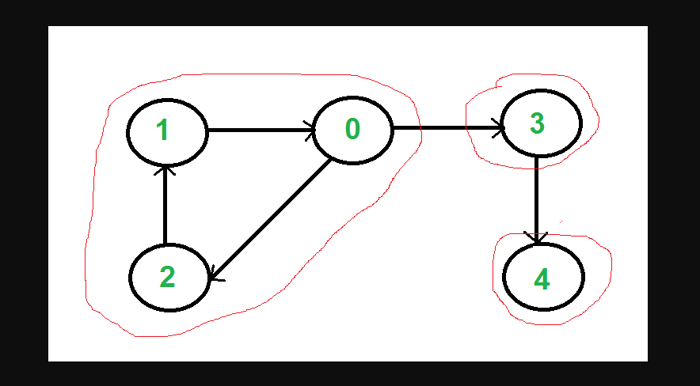

CUsefulness of Connected Components
There are a lot of theoretical uses of connected components that are beyond the scope of the course. But on the more practical front, here are some potential uses:

Look for people you might know in a social network.
Predict the spread of zombie apocalypse or other disease within social groups.
Determining which parts of a computer network are reachable from another.
Finding clusters of related information.
Finding Connected Components
If you have a BFS or DFS, finding connected components is pretty straightforward if you modify your search to return a list of verts visited. (Also modify the search to not always color the verts white at the start.)

connected_components = [];

for v in graph.vertexes:
  v.color = white

for v in graph.vertexes:
  if v.color == white:
    component = bfs(v)
	connected_components.push(component);

# How to find them:
## for each node in the graph:

a. Has it been explored?
    NO- DO BFS

- all the nodes you reach are connected

    YES- Already in a connected component

# Strongly connected graphs:
 has directionality feature, node1 can get to node2, node 2 can get to node1 
 versus not strongly connected,where we're  _not_ saying anything about which nodes can get to each other

Strongly Connected Components. A directed graph is strongly connected if there is a path between all pairs of vertices. A strongly connected component (SCC) of a directed graph is a maximal strongly connected subgraph.

In the mathematical theory of directed graphs, a graph is said to be strongly connected if every vertex is reachable from every other vertex. The strongly connected components of an arbitrary directed graph form a partition into subgraphs that are themselves strongly connected. 

# review:

Connected Components allow us to find connected elements w/in large, disjointed graphs.

BFS or DFS algos can be used to find connected components 
Strongly Connected Components. A directed graph is strongly connected if there is a path between all pairs of vertices. A strongly connected component (SCC) of a directed graph is a maximal strongly connected subgraph.
`For example, there are 3 SCCs in the following graph.`

#random isnt accurate, bc we're prob most likely to be friends with ppl within clusters, our track, our TL group, our project etc

Voronoi- do better random generation/distribution that follows clustering pattern
cloud generation algo

